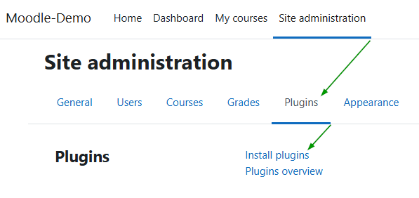
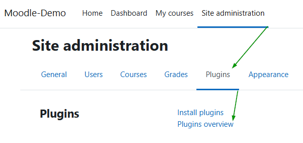
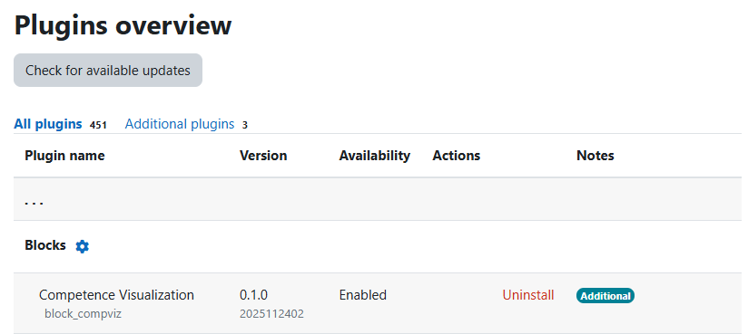

# Installationsanleitung — Competence Visualization (block_compviz)

Dieses Plugin ist ein Moodle-Block-Plugin und muss unter dem Moodle-Ordner `blocks/` installiert werden.

## Voraussetzungen

- Sie haben eine laufende Moodle-Installation und Administratorzugang.
- Moodle-Version: **Moodle 4.1 oder neuer** (Mindestanforderung: `requires = 2022112800`).
- Wenn Sie per Web-UI (ZIP-Upload) installieren, benötigt der Webserver Schreibrechte im Moodle-Verzeichnis. Falls dies nicht möglich ist, verwenden Sie bitte die manuelle Installation (Option B).
- Empfehlung: Erstellen Sie vor der Installation ein Backup oder einen Snapshot Ihrer Moodle-Instanz (das Plugin hat zum Zeitpunkt der Erstellung Alpha-Reife).
- Die kursspezifischen Voraussetzungen auf Kurs-Ebene finden Sie im Abschnitt „[Wichtige kursspezifische Voraussetzung](#wichtige-kursspezifische-voraussetzung)" weiter unten.

---

## Option A — Installation über die Moodle-UI (ZIP-Upload)

1. Laden Sie das Plugin-Archiv von den Projekt-Releases herunter (z. B. von der GitHub-Releases-Seite).
2. Melden Sie sich als Administrator in Ihrer Moodle-Instanz an.
3. Navigieren Sie zu **Site administration → Plugins → Install plugins**.
   
4. Wählen Sie die ZIP-Datei aus und laden Sie sie hoch. Moodle prüft das Archiv und zeigt den erkannten Plugin-Typ sowie den vorgesehenen Zielpfad an. Prüfen Sie vor dem Fortfahren, dass der erkannte Typ **Block** ist und der Zielpfad auf `/blocks/compviz` endet.

   - Hinweis: Je nach Inhalt des ZIP-Archivs kann dieses einen Top-Level-Ordner mit dem Namen `compviz`, `block_compviz` oder `compviz-x.y.z` enthalten. Der Moodle-Installer zeigt während der Validierung den erwarteten Zielpfad an — kontrollieren Sie diesen sorgfältig.

5. Wenn die Validierung erfolgreich ist, folgen Sie den Anweisungen auf dem Bildschirm und klicken Sie bei Aufforderung auf **Continue** / **Upgrade Moodle database now**.
6. Nach Abschluss leitet Moodle in der Regel zur Mitteilungs-/Notifications-Seite weiter. Falls nicht, öffnen Sie **Site administration → General → Notifications**, um die Installation abzuschließen.

Hinweis: Wenn Sie den Menüpunkt **Install plugins** nicht sehen können, ist diese Funktion möglicherweise durch Ihren Hosting-Anbieter deaktiviert (z. B. bei einigen Managed-Hosting-Providern). In diesem Fall verwenden Sie bitte Option B.

---

## Option B — Manuelle Installation auf dem Server (Dateisystem)

1. Entpacken Sie das Plugin-Archiv lokal.
2. Kopieren Sie den entpackten Ordner auf Ihren Moodle-Server in:

   - `{MOODLE_DIRROOT}/blocks/compviz`

   Der Ordner muss `compviz` heißen. Wenn Ihr entpackter Ordner `block_compviz` oder `compviz-master` heißt, benennen Sie ihn vor dem Kopieren in `compviz` um.

3. Stellen Sie sicher, dass der Webserver-Benutzer Leserechte für die neuen Dateien hat. Unter Linux bedeutet das typischerweise passende `chown`/`chmod`-Einstellungen; unter Windows müssen Sie sicherstellen, dass das Service-Konto (IIS/Apache) Zugriff hat.

4. Starten Sie die Moodle-Installations-/Upgrade-Prozedur, indem Sie **Site administration → General → Notifications** aufrufen (als Administrator). Moodle erkennt das neue Plugin und führt die erforderlichen Upgrade-Schritte aus.

5. Wenn das Plugin nach dem Aufruf von Notifications nicht erscheint, prüfen Sie bitte, ob die Verzeichnisstruktur die erwarteten Plugin-Dateien enthält (z. B. `block_compviz.php`, `version.php`, `lang/`, `classes/`, `README.md`) und ob der Ordner tatsächlich unter `{MOODLE_DIRROOT}/blocks/compviz` liegt.

---

## Nach der Installation — Kurze Prüfungen

### 1) Bestätigen, dass das Plugin installiert ist

- Öffnen Sie **Site administration → Plugins → Plugin overview** und suchen Sie nach „Competence Visualization“ oder `block_compviz`.
- Prüfen Sie, dass das Plugin in der Liste auftaucht und als installiert angezeigt wird.

### 2) Block in einen Kurs hinzufügen (Lehrende / Manager)

1. Öffnen Sie den Kurs mit einem Konto, das Bearbeitungsrechte besitzt.
2. Schalten Sie den Bearbeitungsmodus ein (Edit mode).
3. Wählen Sie aus dem Menü „Add a block“ die Option **Competence Visualization**.
   
4. Öffnen Sie im Bearbeitungsmodus die Instanz-Einstellungen (Zahnrad-Symbol). 
   
5. Setzen Sie die Option **Select Learning Outcome Category** auf die gewünschte Gradebook-Kategorie oder das Kompetenz-Set.
   

Standardrechte (laut Plugin-Capabilities):

- Manager und Editing Teachers dürfen den Block hinzufügen.
- Nutzer mit der Capability `block/compviz:show_graph` können den Blockinhalt sehen.

---

## Wichtige kursspezifische Voraussetzung

Der Block bezieht seine Struktur und Daten aus dem Notenbuch und/oder dem Moodle-Kompetenz-Framework. Kurz:

- **LEO Category**: Bewertungs-Kategorien, die Lernziele gruppieren.
- **LEOs**: Unterkategorien, die µLEOs enthalten.
- **µLEOs**: Einzelne Bewertungs-Items (Aktivitäten, Quizzes, Aufgaben) die einem LEO zugeordnet sind.

Wenn Ihr Kurs nicht in ähnlicher Weise Kategorien/Kompetenzen verwendet, kann der Block keine Daten anzeigen.

---

## Aktivitätsabschluss (optional)

Der Block kann Completion-Zustände (z. B. Passed/Failed) aus Aktivitäten wie Quizzes berücksichtigen. Damit das funktioniert, muss Activity Completion im Kurs und für die jeweilige Aktivität aktiviert und konfiguriert sein.

---

## Deinstallation

1. Melden Sie sich als Administrator an und öffnen Sie **Site administration → Plugins → Plugin overview**.
2. Suchen Sie nach `block_compviz` und wählen Sie **Uninstall**.
3. Folgen Sie den Bildschirmanweisungen. Wenn Moodle meldet, dass das Plugin in Verwendung ist, lösen Sie die Abhängigkeiten, bevor Sie erneut deinstallieren.
4. Moodle entfernt normalerweise die Plugin-Dateien; falls das nicht geschieht, löschen Sie den Ordner `{MOODLE_DIRROOT}/blocks/compviz` manuell.

---

## Troubleshooting (typische Fälle)

- **UI-Installation schlägt fehl / kein Schreibzugriff:** Installation per Option B (manuell).
- **Nach dem Kopieren passiert nichts:** Prüfen Sie, ob der Ordner korrekt benannt ist und die Plugin-Dateien vorhanden sind (siehe Schritt 5 in Option B). Rufen Sie dann **Site administration → General → Notifications** auf, um die Installation zu triggern.
- **Block zeigt keine Daten:** Prüfen Sie die Notenbuch-Kategorien/Items und ob die Instanz auf die richtige Kategorie/Kompetenz zeigt.
- **Rechteprobleme beim Hinzufügen:** Prüfen Sie Rollen und Capabilities (in der Regel Manager oder Editing Teacher).

