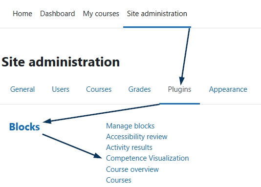
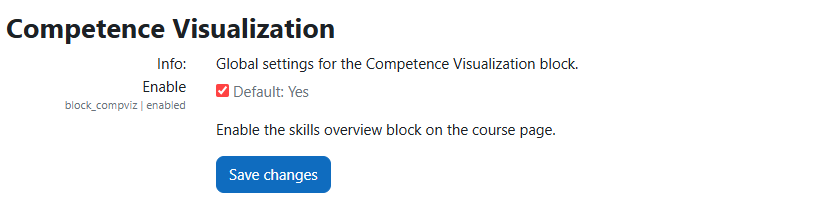
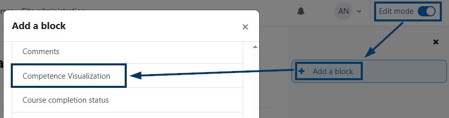
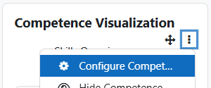
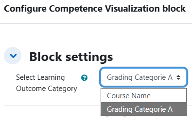
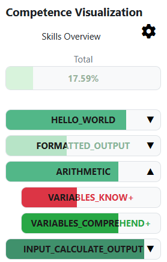
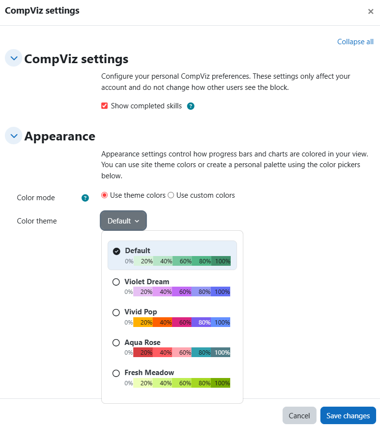

# User Guide – Moodle Block „Competence Visualization“ (block_compviz)

[TOC]

## Introduction

The Competence Visualization (CompViz) plugin aims to shows course competency and grade-category progress as progress bars so students can quickly identify strengths, gaps and next steps. This guide covers the usage: how to configure an instance inside a course, interpret the visuals, and act on the results.

### Overall naming conventions and informations

The block derives its structure and data from the course **gradebook**. In brief:

- **LEO Category**: assessment categories that group all learning outcomes. This may also be the course itself if there are no additional grading categories or activities that are not mapped to a LEO.
- **LEOs**: sub-categories that contain the µLEOs and group them together to create competencies.
- **µLEOs**: individual grade items (activities, quizzes, assignments) mapped to an LEO.

If your course does not have grade categories or competencies arranged in this way, the block may show no data!

## Administrator

To install the plugin please follow the [Installation Guide](Compviz_Install_EN.md) provided with this plugin files.
After that an administrator of a Moodle instance can change some global settings affecting all instances of this block.

Go to: **Site administration → Plugins → Blocks → Competence Visualization**. 

In there we currently have the following settings:
- **Enable**: Toggles whether the block plugin is available to add in any course and if already added hides the whole block.

## Teacher

### Add and configure the block

To add the block to your course:

1. Turn editing on in your course and add the **Competence Visualization** block via the "Add a block" menu.

      

2. Open the block instance settings (gear icon) to choose what the block shows.

      
      
3. For the **Select Learning Outcome Category** select the gradebook category where all other categories that represent the LEOs are grouped together. if the course itself only exits of LEOs and µLEOs then the course itself can be selected here.
   
      

### Short teacher checklist before a course starts:

- Group grade items into meaningful grade categories that represent your learning outcomes.

- Verify the block instance points to the intended grade category or competency set and preview the view.

### Troubleshooting
- No data visible:
  - Confirm the instance is pointing to the intended grade category or competency set.
  - Verify there are visible grade items in that category or that competencies are linked to activities.
- Unexpected numbers:
  - Check gradebook aggregation and hidden items; CompViz reads the numeric values the gradebook exposes.
- Charts failing to render:
  - Open the browser console (F12) and check for errors; try purging caches (Site administration → Development → Purge all caches) and retry.

If problems persist, capture screenshots and any console errors and contact your Moodle administrator.

## Student

### Reading the visualizations and acting on them

On any course page where a teacher has added the CompViz block you can find the overview on the right hand sidebar.

You can use the overview to:

- see which competencies you are strong in and which need more work.

- drill down on a competency to see the items or activities that contributed to the score.

- adjust personal appearance settings to make the visuals easier for you to read and enjoy.

  

Some short tips

- The block uses colors and progress bars to indicate attainment levels; consult the block settings help text for exact meaning.
- Missing or empty values usually mean an activity is not linked or a grade item is hidden — contact your teacher if something looks wrong.

### Personal appearance

Each user can configure how CompViz is colored and displayed for their account. Look for a **gear icon**  in the top right part of the block.

In there you find the following settings and what they do:

- **CompViz Settings**: Grouping of general settings and behavior of the block.
  - **Show completed skills**: toggle whether completed items are visible in your personal view.

- **Appearance**: Grouping of all settings that change the coloring of the block.
  - **Color mode**: choose between using predefined theme colors or custom colors.
  - **Color theme**: select a saved color palette.
  - **Progress colors**: pick individual colors for progress bands when custom colors are enabled. The Color selectors divide the progress bars int 5 sections where each section represent 20% of overall progress. So the lowest color is from 0% till 20% and the highest from 80% up until 100% completion of the LEO.
    *Hint*: If your teacher enabled completion conditions the µLEOs are colored green or red depending if you successfully completed a task or failed it. If no completion conditions are set the µLEOs will use the same coloring scheme as the LEOs.

  

These personal preferences do not affect other users' views and are course independent.

## Additional Readings

- `README.md` — project notes and any additional documentation shipped with the plugin.
- `Docs/Compviz_Install_EN.md` — install documentation for the plugin.
- `Docs/Compviz_Install_DE.md` — install documentation for the plugin in german.
